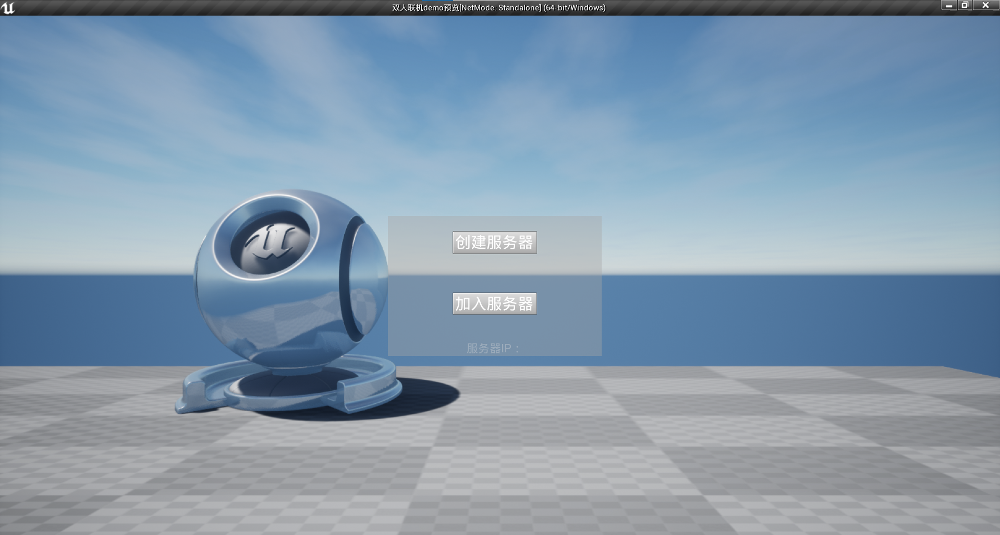
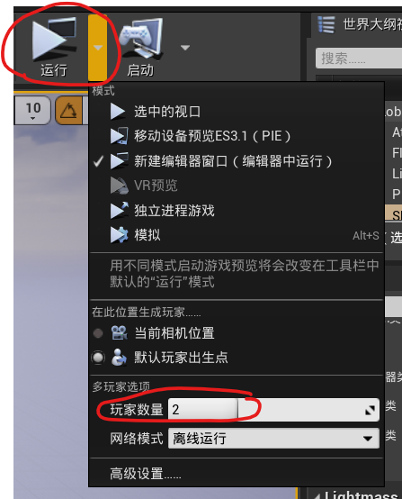
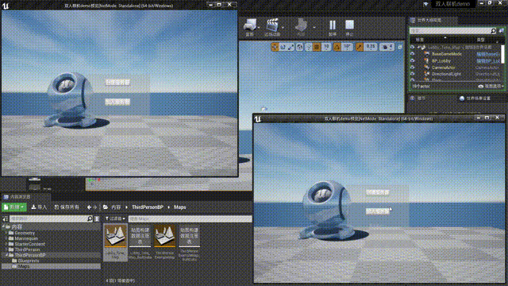

# 多人联机DEMO

## 1.使用说明

​	该DEMO是基于UE4的第三人称模板改的多人联机DEMO，工程对应的编辑器版本是UE4.25。

### 使用方式

1. 一个玩家作为主机，点击创建服务器
2. 其他玩家作为客户端，在服务器IP提示框中输入主机（服务器地址），完成后点击加入服务器

### 支持联机模式

- 本地联机
- 同一局域网内联机（能相互ping通）【需打包后在同一局域网内的两台不同的电脑运行】

### 游戏人数修改

在运行->玩家数量->修改参与的玩家数量即可

### 演示

完整演示视频地址：【UE4第三人称游戏模板改多人联机DEMO】https://www.bilibili.com/video/BV1fctqzsEBf?vd_source=1a070845e2c31c6b83606d88099a7079

详细讲解文章：https://www.bilibili.com/opus/1098338577725521927